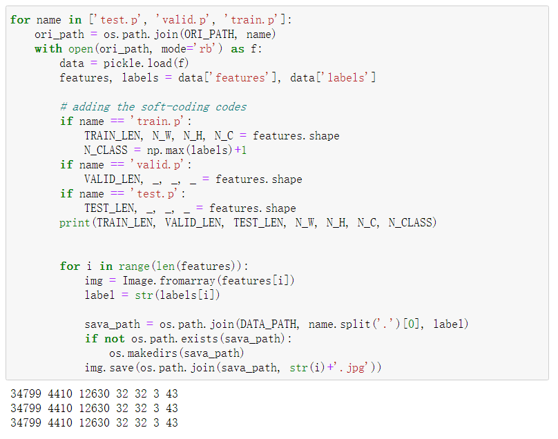

##  Traffjc Sign Classifier
[](http://www.udacity.com/drive)
### Overview

In this project, you will use what you've learned about deep neural networks and convolutional neural networks to classify traffic signs. You will train a model so it can decode traffic signs from natural images by using the [German Traffic Sign Dataset](http://benchmark.ini.rub.de/?section=gtsrb&subsection=dataset). After the model is trained, you will then test your model program on new images of traffic signs you find on the web, or, if you're feeling adventurous pictures of traffic signs you find locally!

### Dependencies

This project requires **Python 3.5** and the following Python libraries installed:

- [Jupyter](http://jupyter.org/)
- [NumPy](http://www.numpy.org/)
- [SciPy](https://www.scipy.org/)
- [scikit-learn](http://scikit-learn.org/)
- [TensorFlow](http://tensorflow.org)
- [Matplotlib](http://matplotlib.org/)
- [Pandas](http://pandas.pydata.org/) (Optional)

Run this command at the terminal prompt to install [OpenCV](http://opencv.org/). Useful for image processing:

- `conda install -c https://conda.anaconda.org/menpo opencv3`

### Dataset

1. [Download the dataset](https://d17h27t6h515a5.cloudfront.net/topher/2016/November/581faac4_traffic-signs-data/traffic-signs-data.zip). This is a pickled dataset in which we've already resized the images to 32x32.
2. Clone the project and start the notebook.
```
git clone https://github.com/udacity/CarND-Traffic-Signs
cd CarND-Traffic-Signs
jupyter notebook Traffic_Signs_Recognition.ipynb
```
3. Follow the instructions in the `Traffic_Signs_Recognition.ipynb` notebook.
4. Please find below Project writeup.

# **Traffic Sign Recognition** 

---

**Build a Traffic Sign Recognition Project**

The goals / steps of this project are the following:
* Load the data set (see below for links to the project data set)
* Explore, summarize and visualize the data set
* Design, train and test a model architecture
* Use the model to make predictions on new images
* Analyze the softmax probabilities of the new images
* Summarize the results with a written report

[//]: # (Image References)

[image1]: ./writeup_images/Input_data.png "Visualization"
[image2]: ./writeup_images/Input_data_viz.png "Image class plot"
[image3]: ./writeup_images/Processed_image.png "Processed image"
[image4a]: ./writeup_images/initial_image.png "initial Image"
[image4]: ./writeup_images/transform_image.png "transform Image"
[image5]: ./writeup_images/validation_curve.png "Validation Curve"
[image6]: ./writeup_images/test_images.png "Test Images"
[image7]: ./writeup_images/detected_images.png "Top 3 Detected Images"
[image8]: ./writeup_images/images_sofmax.png "Softmax Probability"
[image9]: ./writeup_images/Featuremap1.png "Featuremap Conv 1"
[image10]: ./writeup_images/Featuremap2.png "Featuremap Conv 1_pool"
[image11]: ./writeup_images/Featuremap3.png "Featuremap Conv 2"
[image12]: ./writeup_images/Featuremap4.png "Featuremap Conv 2_pooling"


## Rubric Points
### Here I will consider the [rubric points](https://review.udacity.com/#!/rubrics/481/view) individually and describe how I addressed each point in my implementation.  This is a summary.  Continue further to read each in depth.   
1. As per project requirements, Traffic Sign Classifier project Notebook, HTML file and write up Files submitted.
2. Dataset summary & image visualization with image type distribution plot created.
3. Design & test model: which includes preprocessing, model architecture, hyperparameter tunning, training, and solution. 
4. Test model on new images, Trained model tested on new image downloaded from web, and plotted its softmax probability. 
5. Featuremap visualisation, Featuremap for all convolution layaer and pooling layer plotted.

---
# 1. Data Exploration
## Dataset Summary
The dataset includes 43 classes of traffics signs and each image has a 32 * 32 size.
* The size of train dataset: 34799
* The size of test dataset: 12630
* The shape of a traffic sign image: (32, 32, 3)
* The number of labels of the data set: 43 types
## Exploratory Visualization
This study extract all the images from the three original .p files, and saved as rgb images in the file. The codes are shown below. By using a soft-coding method, all parameters we need can be extracted from the original files.



An example of label 1 images in the train file. As you can see, all the images are converted from .p files to .jpg images.


# 2. Design and Test a Model Architecture
## Model Architecture
The submission provides details of the characteristics and qualities of the architecture, including the type of model used, the number of layers, and the size of each layer. Visualizations emphasizing particular qualities of the architecture are encouraged.
The model architecture is shown below:


- I firstly use two convolution layers after the input layers and then added a maxpooling layer. 
- Then I repeat this operation which add more two convolution layers and a maxpooling layer.
- Next I use flatten layer to expand the results of convolutions.
- A full connected layer with an activation function of "relu", a BN and a dropout.
- Finally, a full connected layer with softmax funtion. 
The main model architecture is also visualized as below:


## Preprocessing
The submission describes the preprocessing techniques used and why these techniques were chosen.
I choose normalizing the image from [0, 255] to [0, 1] Addtionally, I carried out one-hot operation on the labels. I was using a fliping method to do the data augmendation, but abandon that method because the prediction accuracy would considerably reduce. 

the reason to perform normalization: 
- Normalization improves the speed of gradient descent to solve the optimal solution.
- Normalization may increase the accuracy

the reason I abondoned the data augmentation:
- I was using fliping to augment dataset, but the accuracy reduced too much.
## Model Training
The submission describes how the model was trained by discussing what optimizer was used, batch size, number of epochs and values for hyperparameters.
- Learning rate: 0.009
- Batch size: 100
- Epochs: 40
- Optimizer: Adam
After training, the accuracy of train category can exceed 99%. The loss and accuracy can be ploted as follows. The accuracy of validate category can exceed 95% , the result is shown as the following two plots.


The accuracy of test set can exceed 95%, shown as below:

## Solution Approach
The submission describes the approach to finding a solution. Accuracy on the validation set is 0.93 or greater.
I tried several times to tune the batch size, epoch and learning rate, finally, I choode 0.009 for the learning rate, 100 for batch size, 40 for epoch. Then the accuracy on the validation set could reach 96%. The procedure of getting this approach is shown below:
- The first time I used the simplest neural network, the main structure is two layers of convolution + one layer of maximum pooling + two layers of fully connected layers;
- The problem of the initial model  is that the model is too simple, resulting in under-fitting , the accuracy has not been improved, and the convergence is very slow.
- Two new convolutional layers and one layer of maximum pooling are added, BN is added after each layer of convolution, dropout and BN are added after the first fully connected layer
- The main adjustment parameters are several commonly used hyperparameters, including BATCH_SIZE, LEARNING_RATE, EPOCHS and the number of neurons in the convolutional layer/fully connected layer
- The number of layers of the neural network, droupout, and the design of BN are more important, because if the neural network is too shallow, it will often lead to poor results and under-fitting of the model. When the new network layers is added, some regularization methods must be added to prevent overfitting. This is also the reason for the introduction of dropout. At the same time, because the network convergence speed is slow, I added BN after each layer, which can speed up the network and also avoid over-fitting.

# 3. Test a Model on New Images
## Acquiring New Images
The submission includes five new German Traffic signs found on the web, and the images are visualized. Discussion is made as to particular qualities of the images or traffic signs in the images that are of interest, such as whether they would be difficult for the model to classify.
I acquired 14 images online. Please check them in the jupyter notebook. The features of these images:
- The brightness and contrast are normal, not too dark just like real-world driving conditions in a normal weather.
- The angle of these images are basically vertical and directly facing  to the driver.
- For the consideration of accuracy, I did not select jittered images or images that have background objeccts.
- Each image just contains one sign. May be I can try multi-signs in one image next time. 


## Performance on New Images
The submission documents the performance of the model when tested on the captured images. The performance on the new images is compared to the accuracy results of the test set.
The prediction results can be obtained here:

- Performance: 14 images are all correctly predicted. The accuracy of prediction is 100%.
- Compare to test set: The accuracy of test set is about 95.7%, 4.3% lower than the accuracy of new images. So obviously, the performance on new images are better. The reason might be that these new images have normal lightness, clear quality. Thus, they are better predicted. 
## Model Certainty - Softmax Probabilities
The top five softmax probabilities of the predictions on the captured images are outputted. The submission discusses how certain or uncertain the model is of its predictions. The softmax prbabilities are shown here:
